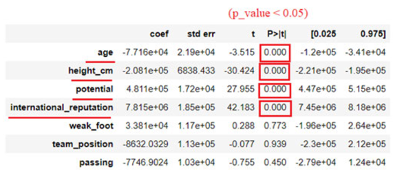
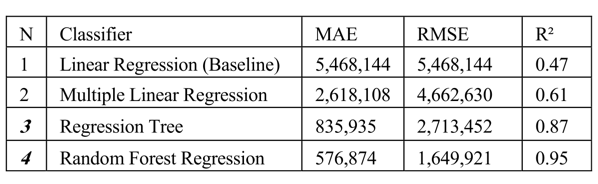

## Şu anda veri setlerini inceleme ve literatür taraması aşamasındayız.

### [Steam Veri Seti](SteamStoreGames)
#### Veri Kaynağı : https://www.kaggle.com/datasets/nikdavis/steam-store-games?select=steamspy_tag_data.csv
Oyunların bilgileri, sistem gereksinimleri, resmi web sayfaları, steam community sayfalarına kadar
detaylı bilgiler içeren bir veri seti. Github dosya limitleri sebebiyle veri setinin tamamını yüklemedim, detayları 
verdiğim kaynak linkinden inceleyebilirsiniz. Çok detaylı incelemedim ancak içerisinde oyularun "fiyat" 
bilgisi yok sanırım. Başka bir kaynaktan fiyatlara erişerek belki bir oyun fiyat tahmini çalışması yapabiliriz
diye düşündüm. Kaagle'da yapılan bir kaç çalışmayı inceledim. Oyun öneri sistemi ve özellik mühendisliği üzerinde
yapılmış çalışmalar var.

### Predict Value of Football Players Using FIFA Video Game Data
#### Makale Linki: https://ieeexplore.ieee.org/stamp/stamp.jsp?tp=&arnumber=9721908 

Bu makalede yazarlar FIFA'nın video oyununda yer alan oyuncuların değerlerini tahmin etmek için bir makine öğrenkesi
modeliyle çalışmışlar.

Makalede yöntem itibariyle veri ön işleme kısımları geçildikten sonra hedef değişkeni en iyi açıklayan değişkenler
seçilmeye çalışılmış ve sonrasında kurulan modeller bu değişkenler üzerinde yoğunlaştırılmış.

Ardından dört adet farklı algoritmayla yeniden model kurulmuş ve bunların başarı kriterleri değerlendirilmiş.

### [VGCharts Veri Seti]([VGCarts](vgcharts))
#### Veri Kaynağı: https://www.kaggle.com/datasets/gregorut/videogamesales
Steam veri setiyle birlikte de kullanılabilir içerisinde oyunların isimlerinin yer aldığı bir değişken var. Ayrıca oyunların satış verilerine dair  ve platformalarına dair bilgileri de içeriyor.

### [Steam Oyun Satış Tahmini 2028]([VGCarts](vgcharts))
#### Veri Kaynağı: https://www.statista.com/statistics/547025/steam-game-sales-revenue/
Steam'in 2028'e kadar olan oyun satışı gelirlerinin tahmin verisi. Kısıtlı bir veri seti ancak
geleceğe dönük bir tahmin projesi gerçekleştirirsek referans olabilir diye düşündüm.
